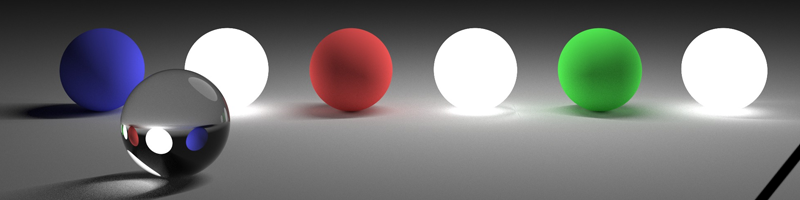
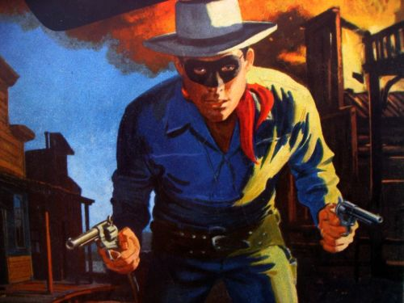
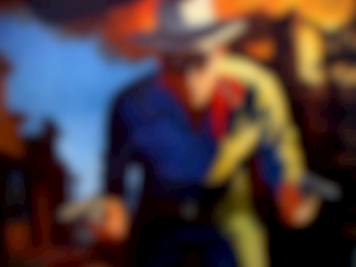

# stackblur
[](https://crates.io/crates/stackblur)
[](https://docs.rs/stackblur)

Fast gaussian blur approximation.

A Rust implementation of [`StackBlur`](https://github.com/flozz/StackBlur) by
[Mario Klingemann](https://underdestruction.com). Very fast and accurate
gaussian blur approximation. Based off of the [Java implementation](https://github.com/verzqli/QQBlurView/blob/master/blurview/src/main/java/com/verzqli/blurview/stackblur/JavaBlurProcess.java) by Enrique López Mañas, licensed
under Apache 2.0.

## Notice

stackblur is currently under heavy development, and may contain breaking
changes between releases. Releases will be stabilized for `1.0.0`.

## Usage

```rust
use std::num::{NonZeroU8, NonZeroUsize};

use stackblur::blur;

const RED: u32 = 0xffff0000;
const GREEN: u32 = 0xff00ff00;
const BLUE: u32 = 0xff0000ff;

// load your image, u32 RGBA pixels
let mut pixels: Vec<u32> = vec![
    RED, GREEN, GREEN, RED,
    GREEN, RED, BLUE, GREEN,
    GREEN, BLUE, RED, GREEN,
    RED, GREEN, GREEN, RED,
];

// blur!
blur(
    &mut pixels,
    NonZeroUsize::new(4).unwrap(),
    NonZeroUsize::new(4).unwrap(),
    NonZeroU8::new(1).unwrap(),
);
```

## Examples

All examples blurred in both directions with radius 15.







Add RGBA PNGs to [`samples/input`](samples/input) and run
`cargo run --release --example samples` to see your own!

### Coding Style

Obey `rustfmt` and Rust 2018 conventions, as well as `clippy` lints.

## Contributing

Pull requests are always welcome.

Unless you explicitly state otherwise, any contribution intentionally
submitted for inclusion in the work by you, as defined in the Apache-2.0
license, shall be dual licensed under the terms of both the MIT License and the
Apache License (Version 2.0).

## Versioning

This project adheres to [Semantic Versioning](https://semver.org/spec/v2.0.0.html).

Changes are documented in the [Changelog](CHANGELOG.md).

See the [tags](https://github.com/owenthewizard/stackblur/tags) for available
releases.

## Authors

See [the list of contributors](https://github.com/owenthewizard/stackblur/contributors).

## License

See [LICENSE-APACHE](LICENSE-APACHE.md) and [LICENSE-MIT](LICENSE-MIT.md) for details.

## Acknowledgments

* [Mario Klingemann](https://underdestruction.com) for the original stackblur
aglorithm.
* Enrique López Mañas for the Java port this code was based off of.
* Many members of the Rust Discord that assisted with various questions and
inspirations.

Want your name here? Contact me or open a PR!
