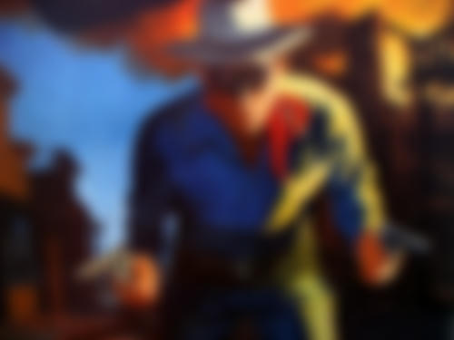

# stackblur
[](https://crates.io/crates/stackblur)
[](https://docs.rs/stackblur)

[](http://isitmaintained.com/project/owenthewizard/stackblur "Average time to resolve an issue")
[](http://isitmaintained.com/project/owenthewizard/stackblur "Percentage of issues still open")

Rust implementation of the
[StackBlur algorithm](https://medium.com/mobile-app-development-publication/blurring-image-algorithm-example-in-android-cec81911cd5e#bfcb)
by [Mario Klingemann](https://underdestruction.com/2004/02/25/stackblur-2004).

Based off of the [Java implementation](https://github.com/kikoso/android-stackblur)
by Enrique López Mañas, licensed under Apache 2.0.

## Notice

This project is currently under heavy development, and may contain breaking
changes between releases. Releases will be stabilized for `1.0.0`.

## Usage

```rust no_run
use std::num::{NonZeroU8, NonZeroUsize};

use stackblur::blur;

// load your image, u32 RGBA pixels
let mut pixels: Vec<u32> = unimplemented!()

// blur!
blur(
    &mut pixels,
    NonZeroUsize::new(1024).unwrap(),
    NonZeroUsize::new(768).unwrap(),
    NonZeroU8::new(15).unwrap(),
);
```

## Examples

All examples blurred in both directions with radius 15.




Add PNGs or JPEGs to [`samples/input`](samples/input) and run
`cargo run --release --example samples` to see your own!

### Coding Style

Obey `rustfmt` and Rust 2018 conventions, as well as `clippy` lints.

## Contributing

Pull requests are always welcome.

Unless you explicitly state otherwise, any contribution intentionally
submitted for inclusion in the work by you, as defined in the Apache-2.0
license, shall be dual licensed under the terms of both the MIT License and the
Apache License (Version 2.0).

## Versioning

This project adheres to [Semantic Versioning](https://semver.org/spec/v2.0.0.html).

Changes are documented in the [Changelog](CHANGELOG.md).

See the [tags](https://github.com/owenthewizard/stackblur/tags) for available
releases.

## Contributors


See [the list of contributors](https://github.com/owenthewizard/stackblur/contributors).

## License

See [LICENSE-APACHE](LICENSE-APACHE.md) and [LICENSE-MIT](LICENSE-MIT.md) for details.

## Acknowledgments

* [Mario Klingemann](https://underdestruction.com) for the
[original stackblur aglorithm](https://underdestruction.com/2004/02/25/stackblur-2004/).
* Enrique López Mañas for
[the Java port](https://github.com/kikoso/android-stackblur) this code was
based off of.
* Many members of the Rust Discord and Reddit communities that assisted with
various questions and inspirations.
* [Railway image](examples/railway.rgba) by
[Martin Winkler](https://pixabay.com/users/fotoworkshop4you-2995268/?utm_source=link-attribution&amp;utm_medium=referral&amp;utm_campaign=image&amp;utm_content=1555348")
from [Pixabay](https://pixabay.com/?utm_source=link-attribution&amp;utm_medium=referral&amp;utm_campaign=image&amp;utm_content=1555348).
